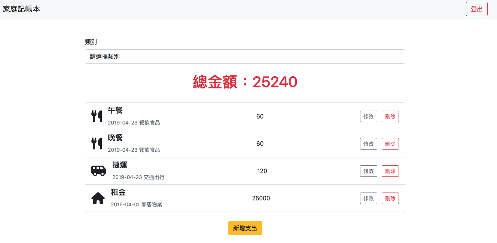

# 老爸的私房錢

這個專案是 AlphaCamp 全端網頁課程，C4 成為軟體工程師 - 後端專修， Mini Capstone Project 的實作作業。主要是透過 Node.js、Express 框架，練習一個簡易的記帳應用程式（Web Applicaton）。

主要功能有：

- 可以透過註冊頁、登入頁建立帳號，登入後建立屬於自己的支出清單
- 瀏覽支出清單、支出清單的總金額；使用者也可以自行新增、修改、刪除特定的支出。
- 使用者可以透過類別篩選，瀏覽特定類別的支出總和


## 功能截圖

- 註冊帳密


- 用帳密登入


- 建立新支出 


- 瀏覽支出清單


- 更新支出資訊


- 依照支出類別篩選


## Getting Started

### Prerequisites

若要嘗試執行此份專案，環境部分您需要先準備以下（由於作者使用 macOS，以下指令以 macOS 為主）：

1. 安裝 Node Version Manager (nvm)

```
$ curl -o- https://raw.githubusercontent.com/creationix/nvm/v0.39.0/install.sh | bash
```

2. 使用 Node Version Manager (nvm) 安裝 node.js 並使用指定版本(`node.js @v18.15.0`)

```
$ nvm install 18.15.0
```

```
$ nvm use 18.15.0
```

3. 檢查是否有安裝成功，並確認 node.js 版本

```
node -v
```

### Installing

1. 將本專案從 GitHub Clone 到自己的本機，並切換到專案資料夾

```
https://github.com/PoMingChen/expense-tracker.git
```

2. 透過 npm 安裝所需的套件，並請留意 `package.json` 中的相依套件版本

```
npm install
```

3. 執行 Migration

- 首先確保個人本地端的資料庫有啟動，並建立一個名稱為 `expense_tracker` 的資料庫。
- 確認個人本地端，與連線該資料庫的帳密是否一致
- 為了符合教案規劃，以及建立種子資料中預設使用者與預設支出清單、支出類別的關聯（User1 廣志，擁有 id = 1~4 的支出，User2 小新擁有 id = 5 的支出），開發過程有建立多個 migrations 檔案，請先執行以下指令後，讓 Sequelize Model Instance 後續可以用相同的規格跟資料庫溝通。

```
npx sequelize db:migrate
```


4. 匯入種子資料

- 本專案一共有兩個 seeder data。`categorySeeder` 和 `recordSeeder`。其中 `recordSeeder` 會一口氣先載入 SEED_USER，接著載入「SEED_USER 的支出紀錄」。
- 該種子資料，執行過程會包含:
  - 針對預設使用者的密碼進行雜湊處理
  - 針對資料庫內既有的使用者、支出清單進行備份（初次執行預期不會有影響）
  - 刪除資料庫內既有的使用者、支出清單（初次執行預期不會有影響）
  - 插入預設使用者、預設支出清單（包含建立預設使用者、預設支出清單、預設支出類別的關聯）

```
npx sequelize db:seed:all
```

5. 補充：由於本專案已經有先透過 sequelize 建立 model instance（modelName: `Record` 和 `User` 和 `Category`），因此可以省略以下動作，直接執行 Migration 和種子資料的匯入。以下指令必要時可以自行回顧。

```
npx sequelize init
```

```
npx sequelize model:generate --name Record --attributes name:string, ... //initiate all the columns corresponding to the table schema in your database.
```

```
npx sequelize model:generate --name User --attributes name:string, ... //initiate all the columns corresponding to the table schema in your database.
```

```
npx sequelize model:generate --name Category --attributes name:string, ... //initiate all the columns corresponding to the table schema in your database.
```

## Running the tests

- 尚未實作

## Deployment

1. 啟動伺服器，執行 app.js 檔案

```
nodemon app.js
```

2. 開啟瀏覽器，並輸入以下網址 `http://localhost:3000`

## Built With

- [Node.js](https://nodejs.org/en)
- [Express](https://expressjs.com)
- [Express Handlebars](https://www.npmjs.com/package/express-handlebars)
- [前端網頁頁面設計 1]（https://codepen.io/alpha-camp/pen/yrLbrZ），由 AlphaCamp 提供
- [前端網頁頁面設計 2]（https://codepen.io/alpha-camp/pen/JVjNgG），由 AlphaCamp 提供

## Contributing

- 無

## Versioning

- 無

## Authors

- [PoMingChen](https://github.com/PoMingChen)

## License

- 無

## Acknowledgments

- [AlphaCamp](https://tw.alphacamp.co/) 導師與助教群
 